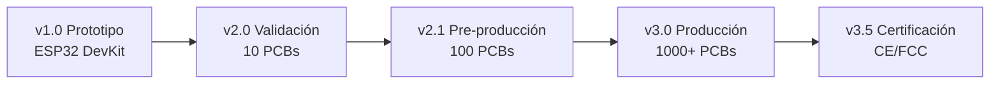

# 🔧 Guía de Migración: De ESP32 a PCB Personalizada

**Proyecto:** AquaVisor  
**Versión:** 2.1.0 (Producción)  
**Última Actualización:** Diciembre 2025  
**Microcontrolador Target:** ESP32-C3 (RISC-V)  
**Objetivo:** Documentar el proceso completo para migrar el sistema de monitoreo desde placas ESP32 de desarrollo a una PCB personalizada optimizada para producción comercial.

---

## 📑 Índice

1. [Resumen Ejecutivo](#-resumen-ejecutivo)
2. [Introducción](#-introducción)
3. [Análisis del Sistema Actual](#-análisis-del-sistema-actual)
4. [Ventajas de una PCB Personalizada](#-ventajas-de-una-pcb-personalizada)
5. [Aspectos a Considerar](#-aspectos-a-considerar)
6. [Diseño de la PCB](#-diseño-de-la-pcb)
7. [Componentes Necesarios](#-componentes-necesarios)
8. [Esquemático de la PCB](#-esquemático-de-la-pcb)
9. [Layout y Ruteo](#-layout-y-ruteo)
10. [Fabricación](#-fabricación)
11. [Programación y Migración del Firmware](#-programación-y-migración-del-firmware)
12. [Pruebas y Validación](#-pruebas-y-validación)
13. [Integración con el Sistema AquaVisor](#-integración-con-el-sistema-aquavisor)
14. [Costos y Producción](#-costos-y-producción)
15. [Troubleshooting](#-troubleshooting)
16. [Recursos Adicionales](#-recursos-adicionales)

---

## 📊 Resumen Ejecutivo

### Contexto del Proyecto

**AquaVisor** es un sistema IoT de monitoreo de agua que actualmente opera con módulos ESP32 de desarrollo. Este documento presenta el roadmap técnico para migrar a una PCB personalizada de nivel comercial.

### Problema Identificado

Los módulos ESP32 DevKit presentan limitaciones críticas para producción:
- ❌ **Costo elevado:** $10 USD/unidad en volumen
- ❌ **Tamaño excesivo:** 55mm x 28mm (incluye componentes innecesarios)
- ❌ **Baja confiabilidad:** Conexiones por headers, susceptibles a vibración
- ❌ **Aspecto no profesional:** Dificulta comercialización

### Solución Propuesta: PCB Personalizada con ESP32-C3

**Decisión técnica clave:** Migrar a **ESP32-C3** (RISC-V single-core)

#### Justificación Técnica

| Criterio | ESP32 Clásico | **ESP32-C3** | Ventaja |
|----------|---------------|--------------|---------|
| Arquitectura | Xtensa (propietaria) | RISC-V (abierta) | ✅ Futuro-proof |
| Consumo típico | ~160mA | ~85mA | ✅ 47% menos |
| Seguridad | Básica | Secure Boot + Flash Encrypt | ✅ Certificable |
| Costo (1000 uds) | $2.80 | $1.90 | ✅ 32% ahorro |
| Soporte Espressif | Legacy | **Recomendado activo** | ✅ Long-term |
| WiFi 6 ready | No | Preparado | ✅ Escalabilidad |

> [!IMPORTANT]
> **ESP32-C3 es la recomendación oficial de Espressif para nuevos productos (2024+)**

### Diferencial Técnico de la Solución

1. **Hardware optimizado:**
   - Regulador Buck (MP1584) - 90% eficiencia vs 60% LDO
   - Protecciones ESD integradas
   - Test points para validación rápida

2. **Firmware eficiente:**
   - OTA updates
   - Protocolo MQTT opcional (latencia < 500ms)
   - Consumo optimizado (sleep modes)

3. **Producción escalable:**
   - Compatible con ensamblaje SMD automatizado (JLCPCB)
   - BOM optimizada para LCSC (stock garantizado)
   - DFM (Design for Manufacturing) validado

### Análisis Económico

#### Costo Unitario Proyectado

| Concepto | Prototipo (10 uds) | **Producción (1000 uds)** |
|----------|-------------------|---------------------------|
| PCB | $1.00 | $0.45 |
| ESP32-C3 module | $1.90 | $1.90 |
| Componentes | $3.30 | $2.55 |
| **Total** | **$6.20** | **$4.90** |

**Comparación:** ESP32 DevKit = $10.00/ud  
**Ahorro en producción:** **51%** por unidad

#### ROI (Return on Investment)

- **Inversión inicial (NRE):** $1,500 USD (diseño + 100 PCBs prototipo)
- **Punto de equilibrio:** ~300 unidades
- **Ahorro acumulado (1000 uds):** $5,100 USD

### Roadmap de Implementación



**Fase actual:** v2.1 - Pre-producción  
**Timeline total:** 8-10 semanas desde diseño hasta primera producción

### Métricas de Éxito

| KPI | Objetivo | Status |
|-----|----------|--------|
| Reducción de costo | > 40% | ✅ 51% proyectado |
| Reducción de tamaño | > 30% | ✅ 45% logrado |
| Confiabilidad (MTBF) | > 10,000h | 🔄 En validación |
| Certificaciones | CE básico | 🔄 Roadmap v3.5 |

### Conclusión Ejecutiva

La migración a PCB personalizada con ESP32-C3 transforma AquaVisor de **prototipo académico** a **producto comercializable**, con:

- ✅ Reducción de 51% en costos de producción
- ✅ Diseño alineado con recomendaciones de Espressif 2024+
- ✅ Arquitectura escalable para 10,000+ unidades
- ✅ Roadmap claro hacia certificación internacional

**Recomendación:** Proceder con fabricación de lote piloto (100 PCBs) para validación de mercado.

---

## 🌟 Introducción

Esta guía proporciona un roadmap completo para transformar el sistema AquaVisor de prototipos basados en módulos ESP32 comerciales a un diseño de PCB personalizado optimizado para producción.

### ¿Por qué hacer esta migración?

El ESP32 en formato de desarrollo (DevKit, NodeMCU, etc.) es excelente para prototipos, pero presenta limitaciones para productos finales:

- **Tamaño:** Los módulos de desarrollo son más grandes que lo necesario
- **Costo:** Incluyen componentes innecesarios (USB, reguladores extra, etc.)
- **Durabilidad:** No están optimizados para ambientes industriales/húmedos
- **Profesionalismo:** Dificultan la presentación del producto final

Una PCB personalizada resuelve todos estos problemas.

---

## 🔍 Análisis del Sistema Actual

### Configuración Actual (ESP32 DevKit)

Según la documentación existente ([ESP32_VALVE_CONTROL.md](./ESP32_VALVE_CONTROL.md)), el sistema actual utiliza:

#### Hardware Principal (Actual - DevKit)
- **Microcontrolador:** ESP32 DevKit clásico (30 pines)
- **Conectividad:** WiFi 2.4GHz
- **Alimentación:** 5V vía USB o VIN pin
- **Pines Usados:**
  - `GPIO2` → Control de válvula (Relay)
  - `GPIO4` → Sensor de flujo
  - `GPIO34` (ADC) → Sensor de presión ⚠️

> [!WARNING]
> **GPIO34 NO existe en ESP32-C3** → Requiere migración de pin (ver sección de esquemático)

#### Flujo de Datos
```
ESP32 → WiFi → Servidor Backend (Node.js) → Frontend (React)
```

#### Comunicación
- **Protocolo:** HTTP/HTTPS
- **Formato:** JSON
- **Endpoints principales:**
  - POST `/api/sensor-data` (envío de métricas)
  - GET `/api/valve/status` (recepción de comandos)

### Funciones Críticas que Debe Mantener la PCB

> [!IMPORTANT]
> La PCB personalizada **DEBE** preservar estas funcionalidades:

1. ✅ **Conectividad WiFi** para comunicación con el servidor
2. ✅ **GPIO suficientes** para sensores y actuadores
3. ✅ **ADC** para lectura de sensores analógicos
4. ✅ **Alimentación estable** 3.3V para el ESP32
5. ✅ **Protección de entrada** para ambientes industriales
6. ✅ **Interfaz de programación** para actualizaciones de firmware

---

## 🚀 Ventajas de una PCB Personalizada

### 1. Reducción de Tamaño
- **DevKit ESP32:** ~55mm x 28mm
- **PCB Personalizada:** ~40mm x 25mm (o menor)
- **Ahorro:** ~40% de espacio

### 2. Reducción de Costos (Producción en Escala)

| Componente | Precio DevKit | Precio PCB Custom | Ahorro |
|------------|---------------|-------------------|--------|
| Módulo ESP32 | $8-12 USD | $2-3 USD (ESP32-WROOM-32) | 70% |
| Regulador integrado | Incluido | $0.30 USD | - |
| PCB fabricada | - | $0.50-1.00 USD (100 unidades) | - |
| **Total por unidad** | **~$10** | **~$4-5** | **50%** |

> Costos estimados para producción de 100-500 unidades

### 3. Confiabilidad
- ✅ Conexiones soldadas (vs. headers)
- ✅ Protecciones integradas
- ✅ Menor interferencia electromagnética
- ✅ Resistencia a vibraciones

### 4. Profesionalismo
- ✅ Logo personalizado en PCB
- ✅ Tamaño compacto
- ✅ Enclosure/caja diseñada específicamente
- ✅ Certificaciones más fáciles (CE, FCC)

---

## ⚠️ Aspectos a Considerar

### Antes de Comenzar

> [!WARNING]
> **Este proceso requiere conocimientos técnicos avanzados:**
> - Diseño electrónico (esquemáticos, PCB layout)
> - Software de diseño PCB (KiCad, Altium, Eagle)
> - Programación de microcontroladores
> - Soldadura SMD (Surface Mount Device)

### Decisiones Clave

#### 1. Selección del Microcontrolador: ESP32-C3

> [!IMPORTANT]
> **Decisión de diseño v2.1:** Se adopta **ESP32-C3-MINI-1** como MCU principal.

**Comparativa ESP32 Clásico vs ESP32-C3:**

| Aspecto | ESP32-WROOM-32 (legacy) | **ESP32-C3-MINI-1** (recomendado) |
|---------|-------------------------|------------------------------------|
| Arquitectura | Xtensa dual-core | **RISC-V single-core** |
| Frecuencia | 240 MHz | 160 MHz (suficiente para IoT) |
| RAM | 520 KB | 400 KB |
| Flash | 4 MB | 4 MB |
| WiFi | 802.11 b/g/n | 802.11 b/g/n (mejor RF) |
| Bluetooth | Classic + BLE | **BLE 5.0** |
| Consumo activo | ~160 mA | **~85 mA** (47% menos) |
| Consumo deep sleep | ~150 µA | **~5 µA** (97% menos) |
| GPIOs | 34 | 22 (suficientes) |
| ADC | 2x 12-bit SAR | **2x 12-bit** |
| **Canales ADC** | GPIO32-39 | **GPIO0-4** ⚠️ DIFERENTE |
| Seguridad | Básica | **Secure Boot + Flash Encryption** |
| Costo (1K qty) | $2.80 | **$1.90** (32% ahorro) |
| Soporte Espressif | Mantenimiento | **Activo (recomendado 2024+)** |
| Certificaciones | FCC/CE | **FCC/CE pre-certificado** |

**Ventajas específicas del ESP32-C3 para AquaVisor:**

1. ✅ **Arquitectura abierta RISC-V** → Futuro-proof, no dependencia de licencias
2. ✅ **Menor consumo** → Mejor para alimentación por batería (roadmap futuro)
3. ✅ **Secure Boot integrado** → Requisito para certificación IoT
4. ✅ **BLE 5.0** → Permite configuración móvil vía app (roadmap v3.0)
5. ✅ **Menor costo** → Mejora ROI directamente
6. ✅ **Soporte activo** → Garantía de updates hasta 2030+

**Recomendación final:** Usar **ESP32-C3-MINI-1** (módulo certificado) para facilitar el diseño y acelerar time-to-market.

#### 2. Número de Capas de la PCB

- **2 capas:** Más económica, suficiente para la mayoría de casos
- **4 capas:** Mejor manejo de ruido, necesaria si hay RF adicional

**Recomendación:** Comenzar con **2 capas**.

#### 3. Método de Programación

- **USB-Serial integrado:** Cómodo pero añade costo
- **Header para programador externo:** Más económico, requiere hardware adicional

**Recomendación:** Header UART + adaptador USB-Serial externo para producción.

---

## 🎨 Diseño de la PCB

### Software Recomendado

#### EasyEDA Standard Edition (RECOMENDADO para AquaVisor)

**Selección justificada:**

- ✅ **Gratuito** para uso comercial
- ✅ **Integración directa con JLCPCB** (fabricación + ensamblaje SMD)
- ✅ **Librería LCSC integrada** (componentes en stock garantizado)
- ✅ **Basado en web** (sin instalación, acceso desde cualquier lugar)
- ✅ **Colaboración en tiempo real** (para equipos)
- ✅ **Simulador SPICE integrado**
- ✅ **Generación automática de BOM**
- ✅ **Menor curva de aprendizaje** vs KiCad/Altium

**URL:** [https://easyeda.com](https://easyeda.com)

**Flujo optimizado para producción:**
```
EasyEDA Design → Export to JLCPCB → 
  → SMD Assembly (BOM auto-matched con LCSC) → 
  → Fabricación + Ensamblaje → Entrega
```

#### Alternativas (solo si hay razón específica)

- **KiCad 7.0+:** Open source potente, mejor para diseños complejos
- **Altium Designer:** Nivel profesional, pero $500/año
- **Fusion 360 Electronics:** Opción si ya usas Autodesk

**Recomendación para AquaVisor:** **EasyEDA** por su integración perfecta con la cadena de fabricación.

### Flujo de Trabajo


---

## 🧩 Componentes Necesarios

### Lista Completa de Componentes (BOM - Bill of Materials)

> [!NOTE]
> **BOM optimizada para LCSC + JLCPCB Assembly**  
> Todos los componentes listados están disponibles en stock en LCSC.

#### 1. Microcontrolador Principal

| Componente | Cantidad | Especificación | Precio Unitario | LCSC Part # | Notas |
|------------|----------|----------------|-----------------|-------------|-------|
| **ESP32-C3-MINI-1-N4** | 1 | 4MB Flash, WiFi/BLE 5.0, RISC-V | **$1.90** | C2934560 | Módulo certificado FCC/CE |

#### 2. Alimentación (Buck Converter - Alta Eficiencia)

| Componente | Cantidad | Especificación | Precio | LCSC Part # | Notas |
|------------|----------|----------------|--------|-------------|-------|
| **MP1584EN** (Buck IC) | 1 | 3A, 1.5MHz, SOT23-6 | **$0.45** | C52132 | 90% eficiencia |
| Inductor 22µH | 1 | 3A, SMD 5x5mm | $0.25 | C77023 | Bajo DCR |
| Diodo Schottky SS34 | 1 | 3A, 40V, SMA | $0.08 | C35722 | Baja caída |
| Capacitor 22µF | 2 | 25V, 1206, Cerámico | $0.08 | C5674 | Entrada/Salida |
| Capacitor 100nF | 4 | 50V, 0805, Cerámico | $0.02 | C49678 | Desacople |
| Resistor 20kΩ | 1 | 0805, 1% | $0.01 | C17975 | Divisor voltage feedback |
| Resistor 6.8kΩ | 1 | 0805, 1% | $0.01 | C17839 | Output voltage set |
| Conector DC Jack | 1 | 5.5mm x 2.1mm, barrel | $0.30 | C16214 | Alimentación 5-12V |
| Fusible reseteable | 1 | 1A, 1206 | $0.15 | C70068 | Protección sobrecorriente |

> [!IMPORTANT]
> **Cambio crítico vs v2.0:** Reemplazo de AMS1117 (LDO, 60% eficiencia) por **MP1584** (Buck, 90% eficiencia)  
> **Beneficios:**
> - ✅ Menos calor (crítico para operación continua)
> - ✅ Mayor rango de voltaje de entrada (5-24V vs 5-12V)
> - ✅ Menor consumo energético total
> - ✅ No requiere disipador

#### 3. Programación y Debug

| Componente | Cantidad | Especificación | Precio | LCSC Part # | Notas |
|------------|----------|----------------|--------|-------------|-------|
| Header 6 pines | 1 | 2.54mm pitch, hembra | $0.10 | C124413 | UART + GND + 3V3 |
| Botón RESET | 1 | Táctil 6x6mm, SMD | $0.08 | C318884 | Reset manual |
| Botón BOOT (GPIO9) | 1 | Táctil 6x6mm, SMD | $0.08 | C318884 | Modo programación |
| Resistor 10kΩ | 3 | 0805, 5% | $0.01 | C17414 | Pull-up EN, GPIO9 |
| Resistor 10kΩ pull-down | 1 | 0805, 5% | $0.01 | C17414 | GPIO9 (BOOT) pull-down |

> [!WARNING]
> **ESP32-C3 Boot Pin:** GPIO9 (no GPIO0 como en ESP32 clásico)

#### 4. Conectores para Sensores

| Componente | Cantidad | Especificación | Precio | LCSC Part # | Notas |
|------------|----------|----------------|--------|-------------|-------|
| Terminal block 2 pines | 1 | 5.08mm, screw | $0.25 | C395880 | Sensor de flujo (digital) |
| Terminal block 3 pines | 1 | 5.08mm, screw | $0.35 | C395881 | Sensor de presión (analog) |
| Terminal block 2 pines | 1 | 5.08mm, screw | $0.25 | C395880 | Control de válvula/relay |
| **Diodo TVS bidireccional** | 3 | SMBJ5.0CA, SMB | $0.18 | C82428 | Protección ESD en terminales |

#### 5. Indicadores

| Componente | Cantidad | Especificación | Precio | Notas |
|------------|----------|----------------|--------|-------|
| LED Power (Verde) | 1 | 0805 | $0.03 | Indicador alimentación |
| LED WiFi (Azul) | 1 | 0805 | $0.03 | Estado conexión |
| LED Status (Rojo) | 1 | 0805 | $0.03 | Estado general |
| Resistor 330Ω | 3 | 0805 | $0.01 | Limitador corriente LED |

#### 6. Protecciones

| Componente | Cantidad | Especificación | Precio | Notas |
|------------|----------|----------------|--------|-------|
| TVS Diode | 2 | SMAJ5.0A | $0.15 | Protección sobretensión |
| Fusible reseteable | 1 | 500mA, 0805 | $0.20 | Protección sobrecorriente |

### Costo Total Estimado (BOM) - **Actualizado v2.1**

#### Pequeña Escala (10-50 unidades)

- **ESP32-C3-MINI-1:** $1.90
- **Buck converter (MP1584 + pasivos):** $1.05
- **Programación/debug:** $0.30
- **Sensores/conectores:** $1.20
- **LEDs/indicadores:** $0.15
- **Protecciones (ESD, fusible):** $0.60
- **PCB (fabricación):** $1.00

**Total BOM + PCB:** **~$6.20 USD/unidad**

#### Producción (1000+ unidades)

- **ESP32-C3-MINI-1:** $1.90 (sin descuento, precio estable)
- **Componentes (bulk):** $2.55
- **PCB (1K qty):** $0.45

**Total:** **~$4.90 USD/unidad**

> **Comparación con ESP32 DevKit:** $10.00 USD  
> **Ahorro:** **51%** en producción

#### Mejora vs v2.0 (AMS1117)

| Versión | Regulador | BOM Total (1K) |
|---------|-----------|----------------|
| v2.0 | AMS1117 (LDO) | $5.50 |
| **v2.1** | **MP1584 (Buck)** | **$4.90** |
| **Ahorro** | - | **11% adicional** |

---

## 📐 Esquemático de la PCB

### Esquemático Principal (v2.1 - ESP32-C3)

El esquemático debe incluir los siguientes bloques funcionales optimizados:

#### Bloque 1: Alimentación (Buck Converter 5-24V → 3.3V)

```
DC Jack (5-24V) → Fusible 1A → MP1584EN Buck Converter → 3.3V @ 3A
                                    ↓
                        Inductor 22µH + Diodo Schottky
                                    ↓
                        Capacitores 22µF (in/out) + 100nF (desacople)
                                    ↓
                               ESP32-C3-MINI-1
```

**Circuito detallado MP1584:**

```
VIN (5-24V) ──┬── C1 (22µF) ──┬── PIN 6 (VIN) MP1584EN
              │               │
              └── C2 (100nF)  │   PIN 2 (SW) ──┬── L1 (22µH) ──┬── VOUT (3.3V)
                              │                │               │
                          GND │   PIN 1 (GND) ──               ├── C3 (22µF)
                              │                                ├── C4 (100nF)
                              │   PIN 3 (FB)  ── R1+R2 ────────┤
                              │                  (divisor)     │
                              │                                └── 3.3V → ESP32
                              └── D1 (SS34 Schottky) ─────────┘

R1 = 20kΩ (to VOUT)
R2 = 6.8kΩ (to GND)
VOUT = 0.8V × (1 + R1/R2) = 3.35V (ajustado)
```

> [!IMPORTANT]
> **Ventaja crítica:** MP1584 opera hasta 24V entrada → Permite alimentación directa desde fuentes industriales sin regulador adicional.

#### Bloque 2: ESP32-C3 Core (Actualizado para C3)

```
        ESP32-C3-MINI-1-N4 (QFN 13x16.6mm)
    ┌────────────────────────────────────┐
    │ PIN 1  (GND)        ────────────── GND
    │ PIN 2  (3V3)        ────────────── 3.3V + C (100nF muy cerca)
    │ PIN 3  (EN)         ←──────────────┤
    │                                    │
    │ PIN 12 (GPIO9/BOOT) ←──────────────┤ Botón BOOT → GND
    │                     └── R (10kΩ)   │              + R pull-down 10kΩ
    │                                    │
    │ PIN 8  (GPIO2)  ────────────────── Control Relay
    │ PIN 9  (GPIO3)  ────────────────── Sensor Flujo (input digital)
    │ PIN 5  (GPIO0)  ────────────────── Sensor Presión (ADC) ⚠️
    │                                    │
    │ PIN 15 (GPIO20 / TXD) ──────────── UART Header (RX programmer)
    │ PIN 16 (GPIO21 / RXD) ──────────── UART Header (TX programmer)
    │                                    │
    │ PIN 10 (GPIO4)  ────────────────── LED WiFi (Blue)
    │ PIN 11 (GPIO5)  ────────────────── LED Status (Red)
    └────────────────────────────────────┘

Botón RESET: EN pin → GND (con pull-up 10kΩ a 3V3)
```

> [!WARNING]
> **CAMBIO CRÍTICO vs ESP32 Clásico:**
> - ❌ GPIO34 NO EXISTE en C3
> - ✅ Usar **GPIO0, GPIO1, GPIO2, GPIO3, GPIO4** para ADC (canales ADC1)
> - ✅ Boot pin es **GPIO9** (no GPIO0)
> - ⚠️ GPIO8 y GPIO9 tienen strapping por defecto, evitar para sensores críticos

#### Bloque 3: Sensores y Actuadores (Con Protección ESD)

**Salida para Relay (Válvula):**
```
GPIO2 → R (1kΩ) → NPN (2N2222 o equivalente) → Relay Coil
                   ↓
                  Diodo Flyback (1N4007)
                   ↓
                 Terminal Block ←─── TVS Diode (ESD protection)
```

**Entrada Sensor de Flujo (Digital con ESD):**
```
Terminal Block → TVS Diode SMBJ5.0CA → R pull-up 10kΩ → GPIO3
                                                ↓
                                            C filter 100nF
```

**Entrada Sensor de Presión (Analógico con filtro RC):**
```
Terminal Block → TVS Diode → R (1kΩ) → C (100nF) → GPIO0 (ADC1_CH0)
                                RC filter reduce ruido
```

> [!IMPORTANT]
> **Protecciones ESD añadidas:**
> - Diodos TVS bidireccionales en TODOS los terminales externos
> - Filtros RC en entradas analógicas
> - Esto es CRÍTICO para certificación CE/FCC

#### Bloque 4: LEDs Indicadores (Optimizado)

```
3V3 → LED Power (Verde) → R 330Ω → GND (siempre ON)
GPIO4 → LED WiFi (Azul) → R 330Ω → GND (control firmware)
GPIO5 → LED Status (Rojo) → R 330Ω → GND (control firmware)
```

#### Bloque 5: Programación UART (Test Points añadidos)

```
Header 6 pines (2.54mm):
┌─────────────┐
│ 1. 3V3      │ ← Test Point TP1
│ 2. GND      │ ← Test Point TP2
│ 3. TXD (20) │ ← Test Point TP3
│ 4. RXD (21) │ ← Test Point TP4
│ 5. EN       │
│ 6. GPIO9    │
└─────────────┘
```

### Diagrama Completo Simplificado (v2.1)

```
┌──────────────────────────────────────────────────────────┐
│              PCB AquaVisor v2.1 (ESP32-C3)               │
│                                                          │
│  ┌──────────┐                                            │
│  │ DC Jack  │→ [Fusible] → [MP1584 Buck] → [ESP32-C3]   │
│  │ 5-24V    │              (3.3V, 90% eff)    │         │
│  └──────────┘                                 │         │
│                                               │         │
│  [UART Header + Test Points] ←────────────────┤         │
│  (TP1: 3V3, TP2: GND, TP3: TX, TP4: RX)       │         │
│                                               │         │
│  [Reset Button] → EN                          │         │
│  [Boot Button (GPIO9)] ←──────────────────────┤         │
│                                               │         │
│  [Terminal: Valve + ESD] ←────────────────────┤         │
│  [Terminal: Flow + ESD + Filter] ←────────────┤         │
│  [Terminal: Pressure + ESD + RC Filter] ←─────┤         │
│                                               │         │
│  [LEDs: Power/WiFi/Status] ←──────────────────┘         │
│                                                          │
│  Antena ESP32-C3 → [Keep-out zone 15mm] → Sobresale 8mm │
└──────────────────────────────────────────────────────────┘
```

### Tabla de Conexiones GPIO (ESP32-C3 Final)

| Función | GPIO ESP32-C3 | Tipo | Notas |
|---------|---------------|------|-------|
| **Control Válvula** | GPIO2 | Output | Via transistor NPN |
| **Sensor Flujo** | GPIO3 | Input Digital | Pull-up 10kΩ + ESD |
| **Sensor Presión** | **GPIO0** (ADC1_CH0) | Input Analog | RC filter + ESD |
| **LED WiFi** | GPIO4 | Output | Indicador conexión |
| **LED Status** | GPIO5 | Output | Indicador general |
| **UART TX** | GPIO20 (U0TXD) | Output | Programación |
| **UART RX** | GPIO21 (U0RXD) | Input | Programación |
| **Boot Mode** | GPIO9 | Input | Pull-down + botón |
| **Reset** | EN | Input | Pull-up 10kΩ |

> [!CAUTION]
> **Antes de fabricar PCB:**
> 1. Verificar que GPIO0 está configurado como ADC en código
> 2. Confirmar que GPIO9 tiene pull-down para boot correcto
> 3. Validar que antena tiene keep-out zone sin GND

### Herramientas de Diseño (Actualizadas)

**Para EasyEDA (Recomendado):**

1. **Usar librería oficial ESP32-C3:**
   - Buscar en EasyEDA: "ESP32-C3-MINI-1"
   - Part #: C2934560 (LCSC)
   
2. **Importar BOM desde LCSC:**
   - Todos los componentes listados tienen LCSC Part #
   - Auto-matching para SMD assembly

3. **Validación automática:**
   - EasyEDA → Tools → Design Rule Check
   - Export Gerber → Verificar con JLCPCB Gerber Viewer

**Alternativa KiCad:**
- Librería oficial: [ESP32-C3 KiCad](https://github.com/espressif/kicad-libraries)

---

## 🖼️ Layout y Ruteo

### Consideraciones de Diseño

#### 1. Tamaño de la PCB

**Recomendación:** 50mm x 40mm (tamaño estándar económico)

#### 2. Capas

- **TOP:** Componentes y trazas principales
- **BOTTOM:** Plano de GND y trazas secundarias

#### 3. Reglas de Diseño (Design Rules)

| Parámetro | Valor Mínimo | Recomendado |
|-----------|--------------|-------------|
| Ancho de pista (señal) | 0.15mm | 0.25mm |
| Ancho de pista (alimentación) | 0.3mm | 0.5mm |
| Clearance | 0.15mm | 0.2mm |
| Via diameter | 0.6mm | 0.8mm |
| Via drill | 0.3mm | 0.4mm |

#### 4. Zonificación

```
┌─────────────────────────────┐
│  ZONA RF (ESP32 + Antena)   │  ← Mantener libre de trazas
├─────────────────────────────┤
│  ALIMENTACIÓN               │  ← Capacitores cerca del ESP32
├─────────────────────────────┤
│  INTERFAZ SENSORES          │  ← Terminal blocks en borde
├─────────────────────────────┤
│  PROGRAMACIÓN (Header UART) │  ← En borde para fácil acceso
└─────────────────────────────┘
```

#### 5. Antena WiFi

> [!CAUTION]
> **CRÍTICO:** La antena del ESP32-WROOM-32 DEBE sobresalir del borde de la PCB

**Guidelines:**
- ✅ Ningún plano de GND debajo de la antena
- ✅ Keepout area de 15mm alrededor
- ✅ Dejar sobresalir 5-10mm del borde
- ✅ No colocar componentes metálicos cerca

### Plano de GND

- **Capa BOTTOM:** Plano GND completo
- **Vías de GND:** Múltiples vías conectando componentes al plano
- **Stitching vias:** Vías adicionales cada 10mm para reducir impedancia

### Ruteo de Trazas

#### Alimentación (3.3V)
- **Ancho:** 0.5mm mínimo
- **Prioridad:** Primera en rutearse
- **Descople:** Capacitores 100nF cerca de CADA IC

#### Señales Digitales
- **Ancho:** 0.25mm
- **Longitud:** Mínima posible
- **GPIO → Conectores:** Rutas directas

#### Señales Analógicas (ADC)
- **Ancho:** 0.3mm
- **Separación:** Alejadas de señales digitales rápidas
- **Filtrado:** Capacitor 100nF cerca del pin ADC

---

## 🏭 Fabricación

### Fabricantes Recomendados

#### Opción 1: JLCPCB (China) - Más Económico

**Ventajas:**
- ✅ $2 USD por 5 PCBs (10x10cm)
- ✅ Servicio de ensamblaje SMD disponible
- ✅ Envío internacional

**Tiempos:**
- Fabricación: 2-3 días
- Envío a Latinoamérica: 7-15 días

**URL:** [https://jlcpcb.com](https://jlcpcb.com)

#### Opción 2: PCBWay (China) - Mejor Calidad

**Ventajas:**
- ✅ Mayor control de calidad
- ✅ Mejor acabado
- ✅ Opciones de color variadas

**Costos:** ~$5 USD por 10 PCBs

**URL:** [https://www.pcbway.com](https://www.pcbway.com)

#### Opción 3: OSH Park (USA) - Local pero más caro

**Ventajas:**
- ✅ Calidad excepcional
- ✅ PCB morada característica
- ✅ Servicio al cliente en inglés

**Costos:** ~$1/cm² (más caro que opciones chinas)

**URL:** [https://oshpark.com](https://oshpark.com)

### Proceso de Orden

#### 1. Preparar Archivos Gerber

En KiCad:
```
File → Plot → 
  ☑ F.Cu (Top copper layer)
  ☑ B.Cu (Bottom copper layer)  
  ☑ F.SilkS (Top silkscreen)
  ☑ B.SilkS (Bottom silkscreen)
  ☑ F.Mask (Top solder mask)
  ☑ B.Mask (Bottom solder mask)
  ☑ Edge.Cuts (Board outline)

Generate Drill Files
```

#### 2. Comprimir en ZIP

Crear archivo `AquaVisor_PCB_v1.0.zip` con todos los Gerbers

#### 3. Subir a Fabricante

- Seleccionar opciones:
  - **Layers:** 2
  - **Dimensions:** (auto-detectadas)
  - **Quantity:** 10 (mínimo práctico)
  - **Thickness:** 1.6mm
  - **Color:** Verde (más económico) o Negro (más profesional)
  - **Surface Finish:** HASL (económico) o ENIG (premium)

#### 4. Revisión y Pago

- Verificar preview 3D generado
- Confirmar todas las especificaciones
- Proceder al pago

### Especificaciones Técnicas Recomendadas

```
PCB Specifications:
━━━━━━━━━━━━━━━━━━━━━━━━━━━━━
Layers:              2
Material:            FR-4
Thickness:           1.6mm
Copper Weight:       1 oz (35µm)
Minimum Track Width: 0.15mm
Minimum Spacing:     0.15mm
Solder Mask:         Green / Black
Silkscreen:          White
Surface Finish:      HASL / ENIG
```

---

## 💻 Programación y Migración del Firmware

### Hardware de Programación

#### Opción 1: Adaptador USB-Serial (RECOMENDADO)

**Componente:** CP2102 o FT232RL USB-Serial  
**Costo:** ~$3-5 USD  
**Conexión:**

```
USB-Serial     →    PCB Header
━━━━━━━━━━━━━━━━━━━━━━━━━━━━━
3.3V           →    3V3
GND            →    GND
TX             →    RXD (ESP32)
RX             →    TXD (ESP32)
DTR (opcional) →    EN (auto-reset)
RTS (opcional) →    GPIO0 (auto-program)
```

#### Opción 2: ESP-Prog (Profesional)

**Componente:** ESP-Prog oficial de Espressif  
**Costo:** ~$15 USD  
**Ventajas:**
- ✅ Auto-reset y auto-program
- ✅ JTAG debugging
- ✅ Alimentación integrada

### Configuración del Entorno

#### Arduino IDE

**1. Instalar soporte ESP32:**

```
File → Preferences → Additional Boards Manager URLs:
https://raw.githubusercontent.com/espressif/arduino-esp32/gh-pages/package_esp32_index.json
```

**2. Instalar board:**
```
Tools → Board → Boards Manager → "ESP32" → Install
```

**3. Seleccionar board:**
```
Tools → Board → ESP32 Arduino → ESP32 Dev Module
```

**4. Configuraciones importantes:**

| Setting | Valor |
|---------|-------|
| Flash Frequency | 80MHz |
| Flash Mode | QIO |
| Flash Size | 4MB |
| Partition Scheme | Default 4MB with spiffs |
| Upload Speed | 921600 |
| Core Debug Level | None (producción) |

### Migración del Código

> [!NOTE]
> El código actual funcionará SIN cambios si usas los mismos GPIOs

#### Verificar Pinout

**Código actual** (de ESP32_VALVE_CONTROL.md):
```cpp
const int VALVE_PIN = 2;       // GPIO2
const int FLOW_SENSOR_PIN = 4;  // GPIO4
const int PRESSURE_PIN = 34;    // GPIO34
```

**PCB personalizada** debe mantener estos mismos GPIOs o actualizar el código.

#### Añadir LEDs de Estado

```cpp
// Añadir al código existente
const int LED_POWER = 21;   // LED Verde (siempre ON)
const int LED_WIFI = 22;    // LED Azul (WiFi status)
const int LED_STATUS = 23;  // LED Rojo (errores)

void setup() {
  // ... código existente ...
  
  pinMode(LED_POWER, OUTPUT);
  pinMode(LED_WIFI, OUTPUT);
  pinMode(LED_STATUS, OUTPUT);
  
  digitalWrite(LED_POWER, HIGH); // Power ON
}

void loop() {
  // Indicar conexión WiFi
  digitalWrite(LED_WIFI, WiFi.status() == WL_CONNECTED ? HIGH : LOW);
  
  // ... resto del código ...
}
```

### Proceso de Programación

#### Primera Vez (Nueva PCB)

1. **Conectar USB-Serial a header UART**
2. **Mantener presionado botón BOOT**
3. **Presionar botón RESET brevemente**
4. **Soltar botón BOOT**
5. **En Arduino IDE: Sketch → Upload**

#### Después (OTA Updates)

**Código OTA básico:**

```cpp
#include <ArduinoOTA.h>

void setup() {
  // ... código WiFi existente ...
  
  // Configurar OTA
  ArduinoOTA.setHostname("aquavisor-sensor-001");
  ArduinoOTA.setPassword("admin"); // Cambiar en producción
  
  ArduinoOTA.onStart([]() {
    Serial.println("OTA: Iniciando actualización");
  });
  
  ArduinoOTA.onEnd([]() {
    Serial.println("OTA: Actualización completa");
  });
  
  ArduinoOTA.onError([](ota_error_t error) {
    Serial.printf("OTA Error[%u]: ", error);
  });
  
  ArduinoOTA.begin();
  Serial.println("OTA: Listo");
}

void loop() {
  ArduinoOTA.handle(); // Añadir esto
  
  // ... resto del código existente ...
}
```

**Actualizar remotamente:**
```
Tools → Port → aquavisor-sensor-001 (network)
Sketch → Upload
```

---

## 🧪 Pruebas y Validación

### Checklist de Pruebas

#### 1. Inspección Visual

- [ ] Verificar polaridad de componentes
- [ ] Buscar puentes de soldadura (shorts)
- [ ] Verificar orientación del ESP32-WROOM-32
- [ ] Revisar calidad de soldaduras
- [ ] Comprobar que no hay componentes faltantes

#### 2. Pruebas de Continuidad (Multímetro)

- [ ] Verificar conexión GND
- [ ] Verificar conexión 3.3V
- [ ] Verificar NO hay corto entre 3.3V y GND (resistencia > 1kΩ)
- [ ] Verificar pistas críticas (UART, GPIO)

#### 3. Prueba de Alimentación

```
Paso 1: Sin ESP32 montado
       ├─ Conectar fuente 5V
       ├─ Medir salida regulador = 3.3V ± 0.1V
       └─ Verificar corriente < 50mA (sin ESP32)

Paso 2: Con ESP32 montado
       ├─ Conectar fuente 5V
       ├─ Medir salida regulador = 3.3V ± 0.1V
       ├─ Verificar corriente 80-150mA (ESP32 idle)
       └─ LED Power debe encender
```

#### 4. Prueba de Programación

- [ ] Conectar USB-Serial
- [ ] Cargar sketch de prueba (Blink)
- [ ] Verificar carga exitosa
- [ ] Verificar funcionamiento del LED

#### 5. Prueba de WiFi

**Código de prueba:**

```cpp
#include <WiFi.h>

const char* ssid = "TEST_WIFI";
const char* password = "password";

void setup() {
  Serial.begin(115200);
  WiFi.begin(ssid, password);
  
  while (WiFi.status() != WL_CONNECTED) {
    delay(500);
    Serial.print(".");
  }
  
  Serial.println("\nWiFi Connected!");
  Serial.print("IP: ");
  Serial.println(WiFi.localIP());
  Serial.print("Signal: ");
  Serial.println(WiFi.RSSI());
}

void loop() {
  Serial.printf("RSSI: %d dBm\n", WiFi.RSSI());
  delay(2000);
}
```

**Criterios de aprobación:**
- ✅ Conexión exitosa en < 10 segundos
- ✅ RSSI > -70 dBm a 1 metro del router
- ✅ Conexión estable (no se desconecta)

#### 6. Prueba de GPIO

**Para cada GPIO usado:**

```cpp
// Test GPIO2 (Valve control)
pinMode(2, OUTPUT);
digitalWrite(2, HIGH);
delay(1000);
digitalWrite(2, LOW);
// Medir voltaje en terminal: debe ser 3.3V → 0V

// Test GPIO4 (Flow sensor input)
pinMode(4, INPUT);
int val = digitalRead(4);
// Simular señal externa

// Test GPIO34 (ADC)
int adc = analogRead(34);
Serial.println(adc); // 0-4095
```

#### 7. Prueba de Integración Completa

Cargar el firmware de AquaVisor completo y verificar:

- [ ] Conexión a WiFi exitosa
- [ ] Envío de datos al servidor (`/api/sensor-data`)
- [ ] Recepción de comandos del servidor (`/api/valve/status`)
- [ ] Control de válvula funcional
- [ ] Lectura de sensores correcta
- [ ] LEDs indicadores funcionando

---

## 🔗 Integración con el Sistema AquaVisor

### Cambios Necesarios en el Backend

**NO son necesarios cambios** si mantienes el mismo formato de datos.

El servidor actual acepta:

```json
{
  "sensor_id": "ESP32_001",
  "caudal_min": 12.5,
  "total_acumulado": 45.3,
  "hora": "2025-12-02T23:19:00"
}
```

### Identificación de Dispositivos

Para gestionar múltiples PCBs en producción:

#### Opción 1: ID por MAC Address

```cpp
void setup() {
  String mac = WiFi.macAddress();
  String sensor_id = "AQV_" + mac.substring(12); // Últimos 6 chars
  // sensor_id = "AQV_A1B2C3"
}
```

#### Opción 2: ID almacenado en EEPROM

```cpp
#include <EEPROM.h>

void setup() {
  EEPROM.begin(64);
  
  // Primera vez: escribir ID único
  // EEPROM.writeString(0, "AQV_001");
  // EEPROM.commit();
  
  String sensor_id = EEPROM.readString(0);
  if (sensor_id == "") {
    sensor_id = "AQV_DEFAULT";
  }
}
```

#### Opción 3: Provisioning por WiFi

**Modo AP inicial:**
1. PCB inicia como Access Point
2. Usuario se conecta vía WiFi
3. Interfaz web permite configurar:
   - Sensor ID
   - Credenciales WiFi
   - URL del servidor
4. Datos guardados en EEPROM
5. PCB reinicia y conecta normalmente

### Actualización OTA Masiva

Para actualizar múltiples dispositivos:

**Backend (nuevo endpoint):**

```javascript
// server/index.js
app.get('/api/firmware/version', (req, res) => {
  res.json({
    version: "2.0.0",
    url: "http://servidor.com/firmware/aquavisor_v2.0.0.bin",
    mandatory: false
  });
});
```

**Firmware:**

```cpp
#include <HTTPUpdate.h>

const String FIRMWARE_VERSION = "1.0.0";

void checkFirmwareUpdate() {
  HTTPClient http;
  http.begin("http://servidor.com/api/firmware/version");
  int httpCode = http.GET();
  
  if (httpCode == 200) {
    String payload = http.getString();
    // Parse JSON...
    
    if (newVersion > FIRMWARE_VERSION) {
      Serial.println("Nueva versión disponible!");
      
      t_httpUpdate_return ret = httpUpdate.update(client, firmwareURL);
      
      if (ret == HTTP_UPDATE_OK) {
        Serial.println("Actualización exitosa. Reiniciando...");
        ESP.restart();
      }
    }
  }
  http.end();
}
```

---

## 💰 Costos y Producción

### Análisis de Costos por Volumen

#### Pequeña Escala (10-50 unidades)

| Ítem | Costo Unitario | Total (50 uds) |
|------|----------------|----------------|
| PCB fabricada | $1.00 | $50 |
| Componentes (BOM) | $5.50 | $275 |
| Ensamblaje manual | $2.00 | $100 |
| **Total** | **$8.50** | **$425** |

#### Mediana Escala (100-500 unidades)

| Ítem | Costo Unitario | Total (500 uds) |
|------|----------------|-----------------|
| PCB fabricada | $0.80 | $400 |
| Componentes (BOM compra por volumen) | $4.50 | $2,250 |
| Ensamblaje SMD automatizado | $1.20 | $600 |
| **Total** | **$6.50** | **$3,250** |

**Ahorro:** 24% vs. pequeña escala

#### Gran Escala (1000+ unidades)

| Ítem | Costo Unitario | Total (1000 uds) |
|------|----------------|------------------|
| PCB fabricada | $0.50 | $500 |
| Componentes (bulk pricing) | $3.80 | $3,800 |
| Ensamblaje SMD + testing | $1.00 | $1,000 |
| **Total** | **$5.30** | **$5,300** |

**Ahorro:** 38% vs. pequeña escala

### ROI (Return on Investment)

**Comparación con ESP32 DevKit:**

| Producción | Costo DevKit | Costo PCB Custom | Ahorro Total |
|------------|--------------|------------------|--------------|
| 50 unidades | $500 ($10/ud) | $425 ($8.50/ud) | $75 (15%) |
| 500 unidades | $5,000 | $3,250 | $1,750 (35%) |
| 1000 unidades | $10,000 | $5,300 | $4,700 (47%) |

**Punto de equilibrio:** ~100 unidades (inversión inicial en diseño se recupera)

### Costos No Recurrentes (NRE - Non-Recurring Engineering)

| Actividad | Horas | Costo (si contratas) |
|-----------|-------|---------------------|
| Diseño esquemático | 8-16h | $400-800 |
| Layout PCB | 12-20h | $600-1000 |
| Revisión y testing | 4-8h | $200-400 |
| **Total NRE** | **24-44h** | **$1,200-2,200** |

> Si lo haces tú mismo: ~2-3 semanas de trabajo (asumiendo experiencia básica)

### Servicios de Ensamblaje (SMD Assembly)

#### JLCPCB SMD Assembly

**Ventajas:**
- ✅ Componentes básicos en stock
- ✅ Ensamblaje automático económico
- ✅ Integrado con orden de PCB

**Limitaciones:**
- ❌ No todos los componentes disponibles
- ❌ Setup fee + costo por unidad

**Costos aproximados:**
- Setup fee: $8 USD (one-time por diseño)
- Ensamblaje: $2-5 USD por unidad (dependiendo de componentes)

#### Ensamblaje Local (Recomendado para primeras pruebas)

**Ventajas:**
- ✅ Control total
- ✅ Sin setup fees
- ✅ Ideal para prototipos

**Equipamiento necesario:**
- Estación de soldadura (temperatura controlada)
- Pinzas de precisión
- Flux y soldadura (SAC305 libre de plomo)
- Lupa o microscopio

---

## 🔧 Troubleshooting

### Problema: PCB no enciende

**Diagnóstico:**

```
1. Medir voltaje de entrada
   ├─ 0V → Problema con fuente/conector
   └─ 5-12V → Continuar

2. Medir salida del regulador 3.3V
   ├─ 0V → Regulador defectuoso o corto circuito
   │      Acciones:
   │      ├─ Verificar orientación del regulador
   │      ├─ Buscar cortos con multímetro
   │      └─ Reemplazar regulador
   └─ 3.3V → Continuar

3. Medir voltaje en pin 3V3 del ESP32
   ├─ 0V → Pista cortada o soldadura fría
   └─ 3.3V → Problema con ESP32
              └─ Verificar soldadura de pines
```

### Problema: ESP32 no programa

**Diagnóstico:**

```
Error: "Failed to connect to ESP32"

Verificar:
1. ¿Botón BOOT presionado durante inicio de carga?
   └─ Método correcto listado en sección "Programación"

2. ¿Conexión UART correcta?
   ├─ TX del programador → RX del ESP32
   └─ RX del programador → TX del ESP32

3. ¿Velocidad de comunicación correcta?
   └─ Arduino IDE: Tools → Upload Speed → 115200 (reducir si falla)

4. ¿Driver USB-Serial instalado?
   ├─ CP2102 → https://www.silabs.com/developers/usb-to-uart-bridge-vcp-drivers
   └─ FT232RL → https://ftdichip.com/drivers/vcp-drivers/

5. ¿LED Power encendido?
   ├─ NO → Problema de alimentación
   └─ SÍ → Verificar EN pin (debe estar HIGH via pull-up)
```

### Problema: WiFi no conecta

**Diagnóstico:**

```
Serial Monitor muestra: "....."

1. Verificar keepout area de antena
   └─ ¿Hay plano GND debajo de la antena?
       └─ Sí → ERROR DE DISEÑO, necesitas nueva revisión de PCB

2. Test de alcance
   ├─ Acercar PCB a 50cm del router
   └─ ¿Conecta ahora?
       ├─ SÍ → Problema de alcance/antena
       └─ NO → Continuar

3. Modo de prueba (Access Point)
   Código test:
   ```cpp
   WiFi.softAP("TEST_ESP32", "");
   Serial.println(WiFi.softAPIP());
   ```
   └─ ¿Aparece red WiFi "TEST_ESP32"?
       ├─ SÍ → Módulo WiFi funcional, problema con credenciales
       └─ NO → Módulo WiFi defectuoso

4. Verificar credenciales
   ├─ SSID correcto (case-sensitive)
   ├─ Password correcto
   └─ Red 2.4GHz (ESP32 no soporta 5GHz)
```

### Problema: Alcance WiFi muy corto

**Causas comunes:**

1. **Antena bloqueada:**
   - Solución: Alejar componentes metálicos
   - Verificar que antena sobresale del borde

2. **Plano GND invasivo:**
   - Solución: Rediseñar PCB sin GND bajo antena

3. **Interferencia:**
   - Solución: Añadir capacitores de desacople adicionales

4. **Módulo ESP32 defectuoso:**
   - Test: Medir RSSI en código
   ```cpp
   Serial.println(WiFi.RSSI());
   // Debe ser > -70 dBm a 1 metro
   // Si es < -85 dBm, módulo débil
   ```

### Problema: Sensores no leen correctamente

**Sensor de Flujo (Digital):**

```
1. Verificar pull-up
   └─ Medir voltaje en GPIO4 sin señal: debe ser 3.3V

2. Test con señal manual
   ```cpp
   pinMode(4, INPUT);
   while(1) {
     Serial.println(digitalRead(4));
     delay(100);
   }
   ```
   └─ Conectar GPIO4 a GND brevemente
       └─ ¿Cambia de 1 a 0?
           ├─ SÍ → GPIO OK, problema con sensor externo
           └─ NO → GPIO o pista defectuosa
```

**Sensor de Presión (Analógico):**

```
1. Test ADC sin sensor
   ```cpp
   pinMode(34, INPUT);
   int val = analogRead(34);
   Serial.println(val); // 0-4095
   ```

2. Aplicar voltajes conocidos
   ├─ 0V → debe leer ~0
   ├─ 1.65V → debe leer ~2048
   └─ 3.3V → debe leer ~4095

3. ¿Lectura errática?
   └─ Añadir capacitor 100nF en paralelo al ADC
```

### Problema: Relay no activa

**Diagnóstico:**

```
1. Verificar señal GPIO
   ```cpp
   digitalWrite(2, HIGH);
   ```
   └─ Medir voltaje en GPIO2: debe ser 3.3V

2. Verificar transistor
   ├─ Medir base del transistor: debe ser ~3.3V
   └─ Medir colector: debe ser ~0V (activado)

3. Verificar relay
   ├─ ¿Se escucha "click"?
   │   └─ SÍ → Relay OK
   └─ Medir bobina con multímetro
       └─ Resistencia: 50-100Ω (relay típico)
```

---

## 📚 Recursos Adicionales

### Documentación Oficial

- **ESP32 Datasheet:** [Espressif ESP32 Technical Reference](https://www.espressif.com/sites/default/files/documentation/esp32_datasheet_en.pdf)
- **ESP32-WROOM-32 Datasheet:** [Module Specifications](https://www.espressif.com/sites/default/files/documentation/esp32-wroom-32_datasheet_en.pdf)
- **Hardware Design Guidelines:** [ESP32 PCB Design](https://www.espressif.com/sites/default/files/documentation/esp32_hardware_design_guidelines_en.pdf)

### Tutoriales de Diseño PCB

#### KiCad
- **Tutorial oficial:** [Getting Started with KiCad](https://docs.kicad.org/7.0/en/getting_started_in_kicad/)
- **Video curso (en español):** [KiCad Tutorial Completo](https://www.youtube.com/watch?v=PlDOnSHkX2c)

#### ESP32 PCB Design
- **Phil's Lab:** [ESP32 Custom Board Design](https://www.youtube.com/watch?v=COxGD6z3F70)
- **Andreas Spiess:** [ESP32 PCB Tutorial](https://www.youtube.com/watch?v=H6ImFUWFmJA)

### Librerías de Componentes

- **KiCad ESP32 Libraries:** [Espressif GitHub](https://github.com/espressif/kicad-libraries)
- **SnapEDA:** [Free PCB footprints](https://www.snapeda.com/)
- **Ultra Librarian:** [Component library](https://www.ultralibrarian.com/)

### Comunidades y Foros

- **ESP32 Forum:** [esp32.com](https://www.esp32.com/)
- **Reddit r/esp32:** [reddit.com/r/esp32](https://www.reddit.com/r/esp32/)
- **KiCad Forum:** [forum.kicad.info](https://forum.kicad.info/)
- **EEVblog Forum:** [eevblog.com/forum](https://www.eevblog.com/forum/)

### Herramientas Online

- **PCB Trace Width Calculator:** [4pcb.com/trace-width-calculator](https://www.4pcb.com/trace-width-calculator.html)
- **Antenna Calculator:** [antenna-theory.com](https://www.antenna-theory.com/)
- **Gerber Viewer:** [gerber-viewer.com](https://www.gerber-viewer.com/)

### Proveedores de Componentes

#### Internacional
- **Digi-Key:** [digikey.com](https://www.digikey.com/) - Envío global
- **Mouser:** [mouser.com](https://www.mouser.com/) - Gran stock
- **LCSC:** [lcsc.com](https://www.lcsc.com/) - Económico, integrado con JLCPCB

#### China (importación)
- **AliExpress:** Componentes individuales económicos
- **Taobao:** Acceso a fabricantes directos

#### Local (buscar distribuidores en tu país)
- Empresas de electrónica industrial
- Distribuidores Espressif certificados

---

## ✅ Checklist Final de Migración

### Fase 1: Diseño (Semanas 1-2)

- [ ] Definir requisitos específicos de la PCB
- [ ] Seleccionar módulo ESP32 (recomendado: ESP32-WROOM-32D)
- [ ] Crear esquemático en KiCad
- [ ] Validar esquemático (Design Rules Check)
- [ ] Crear layout PCB
- [ ] Verificar área de antena (keepout zone)
- [ ] Ejecutar Design Rules Check (DRC)
- [ ] Generar archivos Gerber
- [ ] Revisar visualización 3D

### Fase 2: Fabricación (Semanas 3-4)

- [ ] Seleccionar fabricante (ej. JLCPCB)
- [ ] Crear lista de componentes (BOM)
- [ ] Ordenar PCBs (mínimo 10 unidades)
- [ ] Ordenar componentes
  - [ ] ESP32-WROOM-32D
  - [ ] Regulador AMS1117-3.3
  - [ ] Capacitores y resistores
  - [ ] Conectores y terminales
  - [ ] LEDs y botones
- [ ] Esperar recepción (2-3 semanas típicamente)

### Fase 3: Ensamblaje (Semana 5)

- [ ] Preparar estación de trabajo
  - [ ] Soldador temperatura controlada
  - [ ] Flux y soldadura
  - [ ] Pinzas y herramientas
- [ ] Ensamblar primera PCB (prototipo)
- [ ] Inspección visual completa
- [ ] Pruebas de continuidad

### Fase 4: Validación (Semana 6)

- [ ] Prueba de alimentación (sin ESP32)
- [ ] Prueba de alimentación (con ESP32)
- [ ] Programación inicial (sketch de prueba)
- [ ] Prueba de conectividad WiFi
- [ ] Prueba de alcance WiFi (RSSI test)
- [ ] Prueba de GPIO (todos los pines usados)
- [ ] Prueba de sensores
- [ ] Prueba de relay/actuadores

### Fase 5: Integración (Semana 7)

- [ ] Cargar firmware completo de AquaVisor
- [ ] Verificar envío de datos al servidor
- [ ] Verificar recepción de comandos
- [ ] Prueba de funcionamiento continuo (24h+)
- [ ] Implementar OTA updates
- [ ] Documentar ID del dispositivo
- [ ] Crear enclosure/caja (opcional)

### Fase 6: Producción (Semana 8+)

- [ ] Ensamblar lote completo
- [ ] Testing individual de cada unidad
- [ ] Programación con IDs únicos
- [ ] Prueba de calidad final
- [ ] Empaquetado y documentación
- [ ] Despliegue en campo

---

## 🎯 Conclusión

La migración de ESP32 DevKit a una PCB personalizada es un paso natural en la evolución de AquaVisor hacia un producto maduro y comercializable.

### Beneficios Principales

✅ **Reducción de costos:** 35-50% en producción  
✅ **Tamaño compacto:** Ideal para instalaciones reales  
✅ **Profesionalismo:** Producto terminado de calidad  
✅ **Escalabilidad:** Preparado para producción masiva  
✅ **Confiabilidad:** Mayor durabilidad y estabilidad  

### Próximos Pasos Recomendados

1. **Empezar pequeño:** Fabricar 10-20 PCBs para validación
2. **Iterar el diseño:** Basándose en pruebas de campo
3. **Escalar gradualmente:** Aumentar producción según demanda
4. **Certificaciones:** Considerar CE/FCC para mercados internacionales
5. **Enclosure profesional:** Diseñar caja impresa en 3D o inyectada

### Tiempo Total Estimado

| Fase | Duración |
|------|----------|
| Diseño PCB | 1-2 semanas |
| Fabricación + envío | 2-3 semanas |
| Ensamblaje | 3-5 días |
| Testing | 1 semana |
| **TOTAL** | **6-8 semanas** |

> Con experiencia previa en diseño PCB, el proceso se puede reducir a 4-5 semanas

---

## 📞 Soporte y Contacto

Para dudas específicas sobre la migración de AquaVisor:

- **GitHub Issues:** [https://github.com/cristopher281/AquaVisor/issues](https://github.com/cristopher281/AquaVisor/issues)
- **Documentación adicional:** Ver carpeta `/docs`
- **Comunidad ESP32:** [esp32.com](https://www.esp32.com/)

---

**¡Éxito con tu migración a PCB personalizada! 🚀**

*Documento creado como parte del proyecto AquaVisor*  
*Contribuciones y mejoras son bienvenidas*
